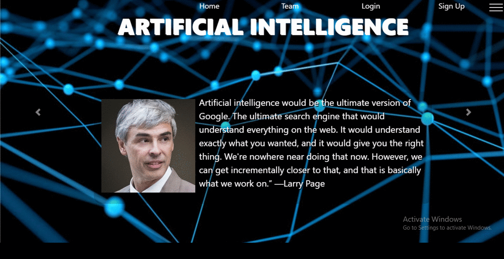

# Silent-words(Actions that speak)
This is a project based on sign language actions and alphabets recognizer,we have made a website that uses SRL alphabet recognizer algorithm to detect the actions on an an online platform using webcam.It uses HTML,CSS,Jquery,Javascript,SQL(for database management),php,python and few python libraries and dependencies.The details of referenced algorithm used for this project is given below.
The demo of given website is here

